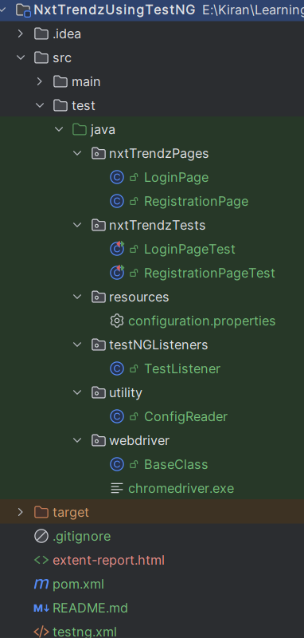

<h1>Project Overview</h1>

**Automation Testing for NxtTrendz Website Using TesnNG**

This repository contains the automation testing framework for the NxtTrendz 
web application using the TestNG framework. The aim of this project is to automate
the testing of various functionalities within the NxtTrendz website, such as user
registration, login, product search, and cart management, to ensure a seamless 
user experience..

**Objective:**

The primary goal of this automation testing project is to ensure the accuracy 
and reliability of the key functionalities on the NxtTrendz website, including:

1. **User Login:** Verifying the login process with valid and invalid credentials.
2. **User Registration:** Testing the registration flow to ensure users can sign up correctly.
3. **Home Page** : Validating the home page elements and their functionality.
4. **Product Page** : Ensuring the product page loads correctly and displays the product details.
5. **Cart Page** : Verifying the cart page functionality, including adding and removing products.

<h1>Technologies Used</h1>

- **Java**: Programming language for writing the test scripts.
- **TesnNG**: Testing framework to manage test execution, group tests, and generate reports.
- **Selenium WebDriver**: For browser automation and interacting with the web elements.
- **Page Object Model (POM)**: Design pattern to structure the framework and maintain page classes.

<h1>Project Structure</h1>

 
<h1>Reports and Results:</h1>

In Selenium using TestNG, you can generate

**Extent Reports:** 

Extent Reports provide rich and customizable HTML reports. These reports 
can be integrated with TestNG to log step-wise test results with screenshots,
logs, and detailed insights.Extent reports can be generated by integrating
the ExtentReports library and logging the test outcomes.

<h1>Setup and Configuration:</h1>

**Prerequisites:**

1. Java 8+ installed

2. Maven installed

3. IDE (e.g., IntelliJ IDEA or Eclipse)

<h1>Project Benefits:</h1>

1. Efficiency: Automating repetitive tasks such as login and registration increases testing efficiency and frees up manual testers to focus on more complex test cases.

2. Reliability: Automated tests reduce the chance of human error during regression testing.

3. Maintainability: The use of TesnNG and Page Object Model makes the tests easy to maintain and scale as the application evolves.

<h1>Conclusion</h1>
This automation testing framework will provide a robust solution to ensure the proper functionality of 
critical user interactions on the NxtTrendz website. It ensures that the core features, such as login 
and registration, perform reliably under various conditions, contributing to the overall quality and 
user experience of the web application.

<h1>Author:</h1>

**Vogeti Satya Kiran**

- **Email**: vogetisatyakiran@gmail.com
- **Phone**: +91 7382482271
- **GitHub**: https://github.com/kiran-gh
- **LinkedIn**: https://www.linkedin.com/in/vogeti-satya-kiran/

**About the Author**
Automation Testing Engineer with a strong background of 3.5 years automation testing experience. Skilled
in creating automated tests using TesnNG and Page Object Model, ensuring the reliability and
maintainability of web applications.